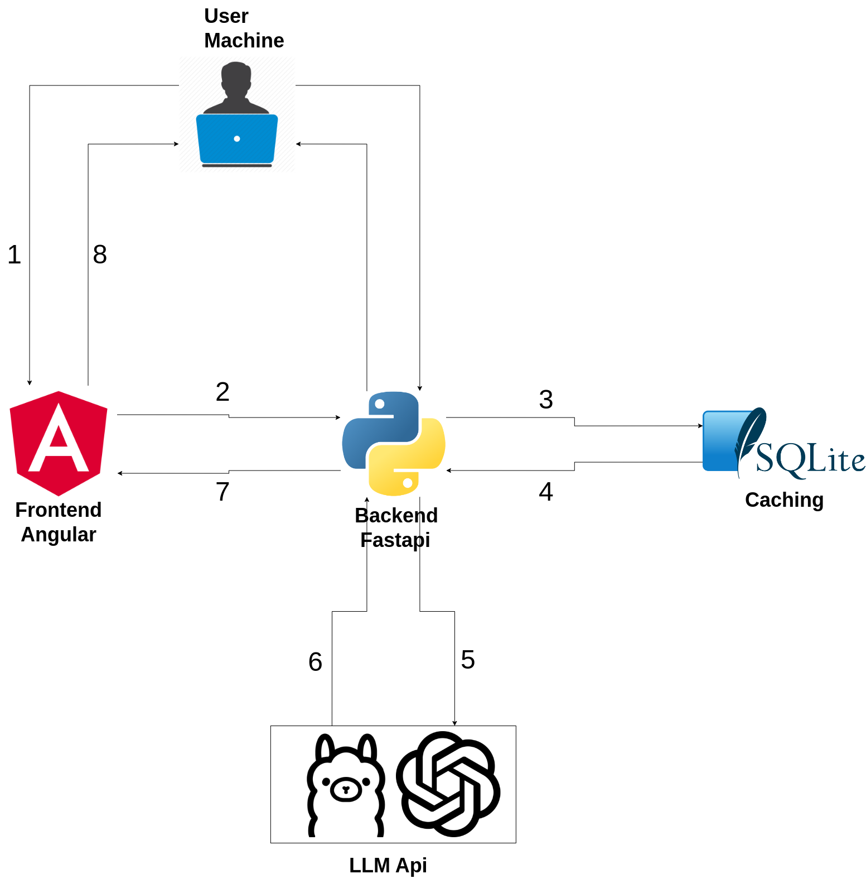

# FileWizardAI

## Description

FileWizardAI is a Python/Angular project designed to automatically organize your files into a well-structured directory
hierarchy and rename them according to their content. This tool is ideal for anyone looking to declutter their digital
workspace by sorting files into appropriate folders and providing descriptive names, making it easier to manage and
locate files. Additionally, it allows you to input a text prompt and instantly searches for files that are related to
your query, providing you with the most relevant files based on the content you provide.

The app also features a caching system to minimize API calls, ensuring that only new or modified files are processed.

### Example:

**Before**

```bash
/home/user
 ├── Downloads
 │   ├── 6.1 Course Curriculum v2.pdf
 │   └── trip_paris.txt
 │   └── 8d71473c-533f-4ba3-9bce-55d3d9a6662a.jpg
 │   └── Screenshot_from_2024-06-10_21-39-24.png
 ```

**After**

```bash
/home/user/Downloads
 ├─ docs
 │  └─ certifications
 │     └─ databricks
 │        └─ data_engineer_associate
 │           └─ curriculum_v2.pdf
 ├─ Personal Photos
 │  └─ 2024
 │     └─ 03
 │        └─ 01
 │           └─ person_in_black_shirt.jpg
 ├─ finance-docs
 │  └─ trip-expenses
 │     └─ paris
 │        └─ trip-justification.txt
 └─ project Assets
    └─ instructions_screenshot.png
```

### Video tutorial:

[](https://www.youtube.com/watch?v=T1rXLox80rM)


## Table of Contents

- [Installation](#installation)
- [Usage](#usage)
- [Run in Development Mode](#run-in-development-mode)
- [Credits](#credits)
- [License](#license)
- [Technical architecture](#technical-architecture)

## Installation

Make sure you have Python installed on your machine.

First, clone the repository:

```bash
git clone https://github.com/AIxHunter/FileWizardAI.git
```

Navigate to the backend folder and update your `.env` file according to the [documentation](.env.md). Then, install the
required
packages by running ( preferably in a virtual environment like venv or conda):

```bash
cd backend
pip install -r requirements.txt
```

## Usage

Run the backend server

```bash
cd backend
uvicorn app.server:app --host localhost --port 8000
```

App will be running under: http://localhost:8000/

## Run in Development Mode

If you are a developper and you want to modify the frontend, you can run the frontend and backend separately, here is
how to do it:
Install Node.js https://nodejs.org/

install Angular CLI:

```bash
npm install -g @angular/cli
```

Run frontend:

```bash
cd frontend
npm install
ng serve
```

The frontend will be available at `http://localhost:4200`.

to package the frontend run:

```bash
ng build --base-href static/
```

Run backend:

Update your `.env` file with the desired API settings (check the [documentation](.env.md)), then:

```bash
cd backend
uvicorn app.server:app --host localhost --port 8000 --reload
```

## Technical architecture



1. Send request from Angular frontend (ex, organize files)
2. Backend receives request through a REST API of FastAPI.
3. Check SQLite if files has already been processed (cached files).
4. Return cached summary if file was already processed.
5. If the file has not been processed before, send new file to LLM for summarization.
6. Cache summary in SQLite.
7. Return summary to Angular frontend.
8. Display summary to user and perform actions if need it.

## License

This project is licensed under the MIT License.
